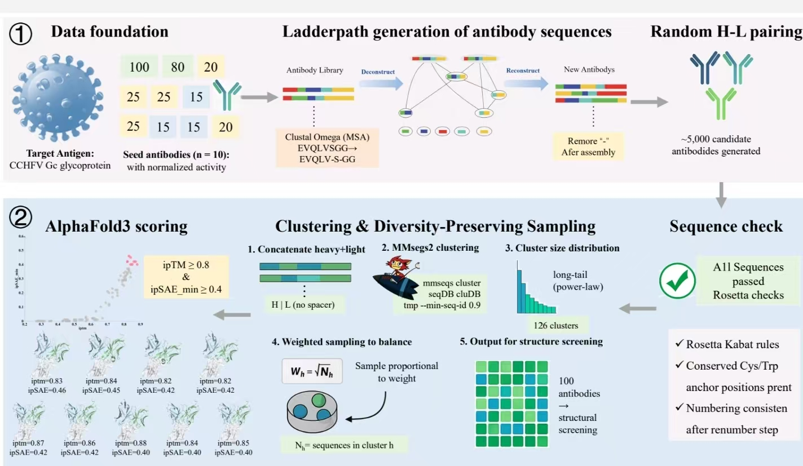

# LPAB Workflow

This repository contains the LPAB workflow and accompanying study data in
[`data/`](data/).

The workflow is summarized in the figure below:

1. Clustal Omega alignment and Ladderpath sequence generation
2. Rosetta antibody chain, framework, and six-CDR checks
3. MMseqs2 clustering of `heavy + light` 
4. Cluster-balanced Monte Carlo sampling with weight `sqrt(cluster size)`
5. AlphaFold 3 prediction
6. Official `ipsae.py` calculation and one final CSV



## Files you need to touch

- `run_lpab.py`: the only program to run.
- `parameters.txt`: paths and adjustable parameters.
- `example_seeds.csv`: example antibody table.
- `example_antigen.fasta`: example antigen sequence.

All implementation details are kept in `lpab_tools/`.

## Study data

The [`data/`](data/) directory contains study files accompanying the manuscript,
including CSV tables, sequence alignments, text files, a PyMOL session (`.pse`),
and a ZIP archive. Filenames beginning with `Fig` indicate the corresponding
manuscript figure and panel.

The supplied study files are stored in `data/`; outputs from new workflow runs
are written to `results/`, as described below.

## Requirements

The wrapper is intended for a Linux workstation or HPC environment. It calls
the following external programs: Clustal Omega, Rosetta antibody, BLASTP,
MMseqs2, and AlphaFold 3. The first four are command-line programs; AlphaFold
3 additionally requires the hardware, databases, and model parameters listed
in its [official installation guide](https://github.com/google-deepmind/alphafold3/blob/main/docs/installation.md).
AlphaFold 3 is not supported on macOS or Windows by its official project.

Run the commands below from the repository root. The LPAB steps and AlphaFold
3 may use separate Python environments.

## Install

Create the LPAB environment and install its Python dependencies:

```bash
conda create -n lpab python=3.11 -y
conda activate lpab
python -m pip install -r lpab_tools/requirements.txt
python -c "import lppack, numpy; print('LPAB dependencies are ready')"
```

This installs the pinned Ladderpath revision and NumPy for the bundled ipSAE
script. Rosetta, BLASTP, MMseqs2, Clustal Omega, and AlphaFold 3 are separate
scientific programs. See [lpab_tools/INSTALL.md](lpab_tools/INSTALL.md) for
installation guidance.

If AlphaFold 3 is installed in a separate environment, set
`alphafold_python` in `parameters.txt` to that environment's interpreter, for
example `/path/to/alphafold3/.venv/bin/python`. Leaving it as `python3` is
correct only when that interpreter can import and run AlphaFold 3. Set the
AlphaFold script/model/database paths and any site-specific executable names,
then check the configuration:

```bash
python run_lpab.py --check
```

## Run

Run the complete workflow:

```bash
python run_lpab.py --step all
```

Long calculations are resumable by running one stage at a time:

```bash
python run_lpab.py --step generate
python run_lpab.py --step rosetta
python run_lpab.py --step cluster
python run_lpab.py --step sample
python run_lpab.py --step af3-input
python run_lpab.py --step af3-run
python run_lpab.py --step collect
```

Each stage writes a numbered result inside `results/`, so it is clear where a
failed or interrupted run should restart. The generated files and local logs
are intentionally ignored by Git.

## Input

The seed CSV accepts either of these column styles:

```text
name,heavy,light,score
name,VH,VL,Score
```

Higher scores increase the chance that motifs from that seed are reused.
Sequences should contain amino-acid letters only. The antigen FASTA must
contain exactly one non-empty sequence. If `use_clustalo = false`, all seed
sequences in each chain must already have equal length.

## Final output

`results/07_final_scores.csv` contains exactly:

```text
name,heavy,light,iptm,ipsae_min,plddt,ptm,pae,ipae
```

- `iptm` and `ptm` come from AlphaFold 3 summary confidences.
- `plddt` is the mean atom pLDDT.
- `pae` is the mean of the full PAE matrix.
- `ipae` is the mean PAE between different chains.
- `ipsae_min` is the lower of the H-antigen and L-antigen `max ipSAE` values
  produced by the bundled, unmodified `ipsae.py` using the cutoffs in
  `parameters.txt`.

The generated AlphaFold jobs use chain IDs `H`, `L`, and `A`.
`collect` refuses to write a final CSV when any requested AlphaFold job is
incomplete or when either H-antigen or L-antigen ipSAE score is missing.

## Reproducibility and limitations

The random seed controls candidate generation, grouped sampling, and the
AlphaFold job seeds. Results can still change with different versions of
Clustal Omega, Rosetta, MMseqs2, AlphaFold 3, or their databases; record those
versions with the final results. The repository pins the Ladderpath commit,
but does not redistribute Rosetta, AlphaFold 3, its model parameters, or its
databases.
